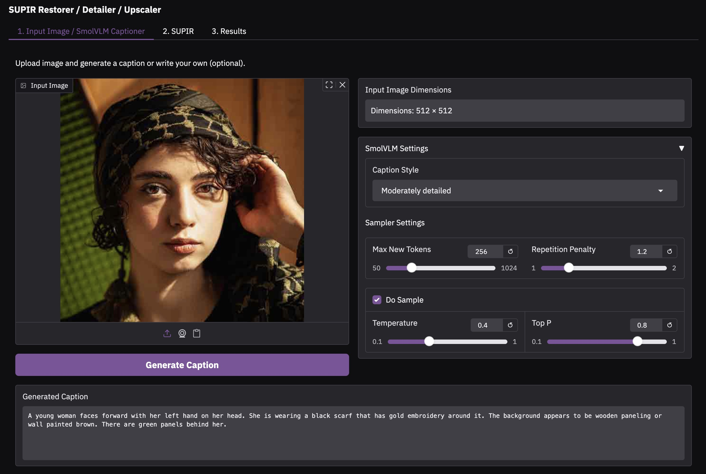
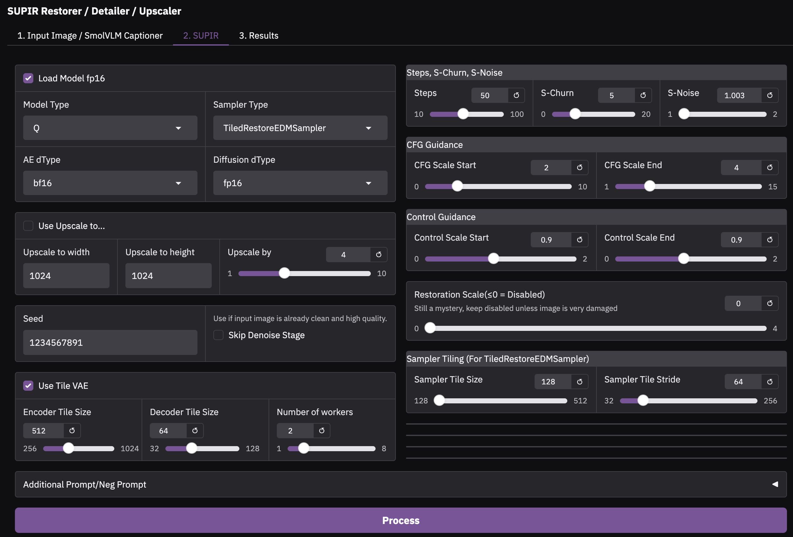
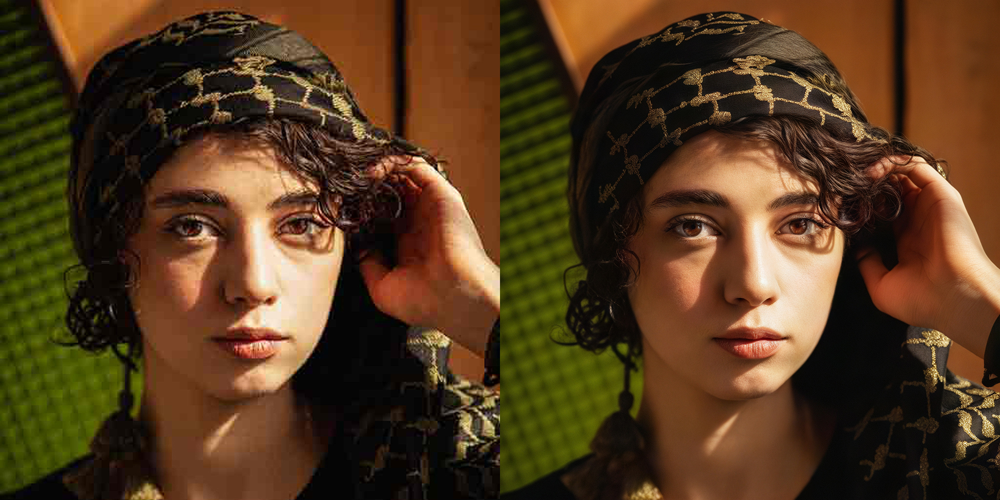
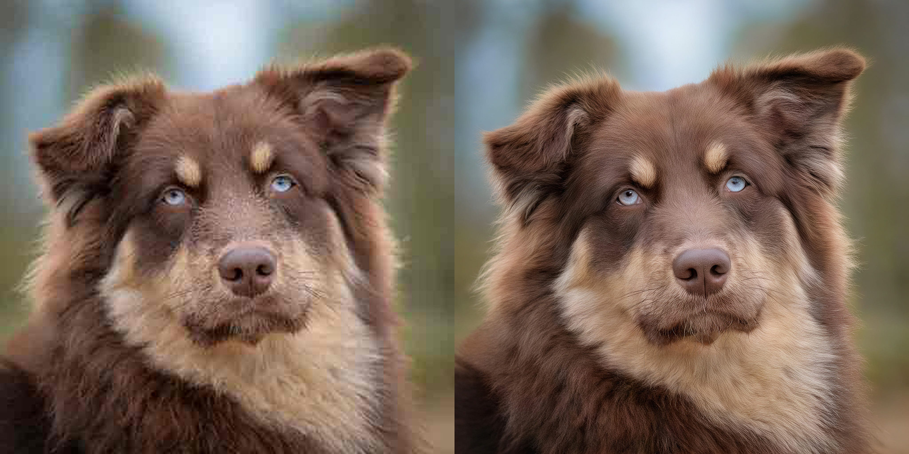

## A Customized Version of the Original [SUPIR](https://github.com/Fanghua-Yu/SUPIR) Project

---
  

  

  

  


---
- Removed the heavy LLaVA implementation. 
- Added safetensors support. 
- Updated dependencies. 
- Replaced SoftMax with SDPA for default attention.
- Removed `use_linear_control_scale (linear_s_stage2)` and `use_linear_cfg_scale (linear_CFG)` arguments.  
   - Uses the start and end scale values to determine whether linear scaling will be used/have effect or not.
- Renamed arguments to make settings a bit more intuitive (more alignment with kijai's SUPIR ComfyUI custom nodes)
  - `spt_linear_CFG` -> `cfg_scale_start`
  - `s_cfg` -> `cfg_scale_end`
  - `spt_linear_s_stage2` -> `control_scale_start`
  - `s_stage2` -> `control_scale_end`
- Added `--skip_denoise_stage` argument to bypass the artifact removal preprocessing step that uses the specialized VAE denoise encoder. This usually ends up with the image slightly softened (before sampling stage) since you do not want artifacts to be considered detail to be enhanced. You might want to skip this step if your image is already high quality. 
- Refactor: Renamed symbol `upsacle` in original code to `upscale`
- Moved CLIP paths to a yaml config file. 
- Exposed `sampler_tile_size` and `sampler_tile_stride` to make them overridable when using `TiledRestoreEDMSampler`
- SUPIR Settings saved into PNGInfo metadata
- Parallel processing for Tiled VAE encoding/decoding
- Improved memory management. On each run, it clears unused GPU (VRAM), cleans up Python's leftover crap, and releases unused RAM back to the system (Linux only). 

---

## Installation

### Clone repo
```bash
git clone https://github.com/yushan777/SUPIR-Demo.git
cd SUPIR-Demo

# For Linux only
chmod +x *.sh
```
### Install Environment 
```bash
# Linux
./install_linux_local.sh

# Linux (Vast.ai)
./install_vastai.sh

# Windows
install_win_local.bat
```

### Download Models 
You can download the models at the same time while the venv is being installed (in a separate terminal)

```bash
# Linux
./download_models.sh

# Windows
download_models.bat
```

---
## Manually Downloading The Models
<details> <summary>ℹ️ See more information</summary>

If you prefer to Download the models manually or in your own time below are the links.  
Additionally, if you already have these models then you can simply symlink them to the locations to save on storage space. 

#### SmolVLM-500M-Instruct 
For captioning input image in the Gradio demo.
* [`SmolVLM-500M-Instruct`](https://huggingface.co/yushan777/SmolVLM-500M-Instruct/tree/main)
Place all files into `models/SmolVLM-500M-Instruct`

#### SUPIR Models

Unless you have more than 24GB of VRAM, you should download the FP16 variants
**FP16 Versions**

* [`SUPIR-v0Q (FP16)`](https://huggingface.co/yushan777/SUPIR/resolve/main/SUPIR/SUPIR-v0Q_fp16.safetensors)
* [`SUPIR-v0F (FP16)`](https://huggingface.co/yushan777/SUPIR/resolve/main/SUPIR/SUPIR-v0F_fp16.safetensors)  
Download and place the model files in the `models/SUPIR/` directory.

**FP32 Versions**

* [`SUPIR-v0Q (FP32)`](https://huggingface.co/yushan777/SUPIR/resolve/main/SUPIR/SUPIR-v0Q_fp32.safetensors)
* [`SUPIR-v0F (FP32)`](https://huggingface.co/yushan777/SUPIR/resolve/main/SUPIR/SUPIR-v0F_fp32.safetensors)  
Download and place the model files in the `models/SUPIR/` directory.

#### CLIP Models
* [CLIP Encoder-1](https://huggingface.co/yushan777/SUPIR/resolve/main/CLIP1/clip-vit-large-patch14/safetensors/clip-vit-large-patch14.safetensors)  
  Place in `models/CLIP1`
* [CLIP Encoder-2](https://huggingface.co/yushan777/SUPIR/resolve/main/CLIP2/CLIP-ViT-bigG-14-laion2B-39B-b160k/safetensors/CLIP-ViT-bigG-14-laion2B-39B-b160k.safetensors)  
  Place in `models/CLIP2`

#### SDXL Model
* [Juggernaut-XL_v9_RunDiffusionPhoto_v2](https://huggingface.co/yushan777/SUPIR/resolve/main/SDXL/juggernautXL_v9Rundiffusionphoto2.safetensors)  
  Place in `models/SDXL`  
  You can use your own preferred SDXL Model.  One that specialises in realism, photographic will work better. 


There are two SUPIR model variants: v0Q and v0F. 

* **SUPIR-v0Q**
The v0Q model (Quality) is trained on a wide range of degradations, making it robust and effective across varied real-world scenarios. However, this broad generalization comes at a cost—when applied to images with only mild degradation, v0Q might overcompensate, hallucinate or alter details that are already mostly intact. This behavior stems from its training bias toward assuming significant visual damage. 

* **SUPIR-v0F**
In contrast, the v0F model (Fidelity) is specifically trained on lighter degradation patterns. Its Stage1 encoder is tuned to better preserve fine details and structure, resulting in restorations that are more faithful to the input when the degradation is minimal. As a result, v0F is the preferred choice for high-fidelity restoration where subtle preservation is more critical than aggressive enhancement.


4. If necessary, edit Custom Path for Checkpoints.  Otherwise leave these alone.
    ```
    * [options/SUPIR_v0.yaml] --> SDXL_CKPT, SUPIR_CKPT_Q, SUPIR_CKPT_F. 
    * [options/SUPIR_v0_tiled.yaml] --> SDXL_CKPT, SUPIR_CKPT_Q, SUPIR_CKPT_F. 
    ```
</details>

---


### Gradio Demo
```bash
source venv/bin/activate
python3 run_supir_gradio.py

# or you can start it with the bash script (contains the above two commands)
chmod +x launch_gradio.sh
./launch_gradio.sh
```


### CLI Demo

```bash
# for cli test
python3 run_supir.py --img_path 'input/bottle.png' --save_dir ./output --SUPIR_sign Q --upscale 2 --use_tile_vae --loading_half_params

python3 run_supir.py \
--img_path 'input/woman-low-res-sq.jpg' \
--save_dir ./output \
--SUPIR_sign Q \
--upscale 2 \
--seed 1234567891 \
--img_caption 'A woman has dark brown eyes, dark curly hair wearing a dark scarf on her head. She is wearing a black shirt on with a pattern on it. The wall behind her is brown and green.' \
--edm_steps=50 \
--s_churn=5 \
--cfg_scale_start=2.0 \
--cfg_scale_end=4.0 \
--control_scale_start=0.9 \
--control_scale_end=0.9 \
--loading_half_params \
--use_tile_vae
```

---
## Tested on Linux Mint, WSL, and Windows 11.  It seems to run faster under Linux. 
---

## Processing Times / Memory Usage
Sampler: TiledRestoreEDMSampler  
Tiled VAE: True  
Number of Workers: 1  
Linux, 64GB RAM  

| Upscale | 4090<br>Time | 4090<br>VRAM | 4080<br>Time | 4080<br>VRAM | 4070<br>Time | 4070<br>VRAM |
|---------|--------------|--------------|--------------|--------------|--------------|--------------|
| 2x      | 111 secs     | 14.0GB       | 227 secs     | 13.7GB       | 301 secs     | 11.7GB       |
| 3x      | 315 secs     | 14.1GB       | 475 secs     | 13.8GB       | 652 secs     | 11.7GB       |
| 4x      | 606 secs     | 14.6GB       | 910 secs     | 13.9GB       | 1625 secs    | 11.7GB       |
| 5x      | 992 secs     | 15.0GB       | 1492 secs    | 14.6GB       | OOM          | OOM          |

---
### Arguments

| **Argument** | **Description** |
|--------------|-----------------|
| `img_path` | Path to the input image. **(required)** |
| `save_dir` | Directory to save the output. |
| `SUPIR_sign` | Model type. Options: `['F', 'Q']`<br>Default: `'Q'`<br>Q model (Quality) Trained on diverse, heavy degradations, making it robust for real-world damage. However, it may overcorrect or hallucinate when used on lightly degraded images due to its bias toward severe restoration.<br>F model (Fidelity) Optimized for mild degradations, preserving fine details and structure. Ideal for high-fidelity tasks where subtle restoration is preferred over aggressive enhancement. |
| `skip_denoise_stage` | Skips the VAE Denoiser Stage. Default: `'False'`<br> Bypass the artifact removal preprocessing step that uses the specialized VAE denoise encoder. This usually ends up with the image slightly softened (if you inspected it at this stage).  This is to avoid SUPIR treating low-res/compression artifacts as detail to be enhanced. <br>You may wish to skip this step if: <br> - 1) You want do do your own pre-processing OR <br> - 2) Input image is clean and free of low-res/compression artifacts or other degradations <br>&nbsp;&nbsp;&nbsp;&nbsp;&nbsp;- Can sometimes make closeups of skin textures a bit unnatural. |
| `sampler_mode` | Sampler choice. Options: `['TiledRestoreEDMSampler', 'RestoreEDMSampler']`<br>Default: `'TiledRestoreEDMSampler' (uses less VRAM)` |
| `seed` | Random seed for reproducibility. Default: `1234` |
| `Use Upscale to..`| If on, use `Update to width` and `Update to height` values for upscaling. If off, then `Upscale by` factor will be used. 
| `Upscale to width`| Upscale input image width to specified dimension if `Use Upscale to..` is on. <br>Minimum: 1024 |
| `Upscale to height`| Upscale input image height to specified dimension if `Use Upscale to..` is on. <br>Minimum: 1024 |
| `Upscale by` | Upscale factor for the input image. <br>Default: `2` <br>Upscaling of the input image is performed before the denoising and sampling stage. <br>Both dimensions are multiplied by the upscale value. If the smaller of the dimensions is still < 1024px, the image is further enlarged to minimum of<br>1024px (aspect ratio maintained).  |
| `***`| **Notes about Upscaling**: <br>The reason for the minimum of 1024 is to give SDXL a comfortable working resolution.  **Note** that dimensions are snapped to the nearest multiple <br>of 64. The sweet spot seems to be between 2x and 4x (1024x1024) or 4x and 8x (512x512). Beyond that, the quality begins to collapse. <br>The higher the scale factor, the slower the process.|
| `min_size` | Minimum output resolution. Default: `1024` |
| `num_samples` | Number of images to generate per input. Default: `1` |
| `img_caption` | Specific caption for the input image.<br>Default: `''`<br>This caption is combined with `a_prompt`. |
| `a_prompt` | Additional positive prompt (appended to input caption).<br>Default:<br>```Cinematic, High Contrast, highly detailed, taken using a Canon EOS R camera, hyper detailed photo - realistic maximum detail, 32k, Color Grading, ultra HD, extreme meticulous detailing, skin pore detailing, hyper sharpness, perfect without deformations.``` |
| `n_prompt` | Negative prompt.<br>Default:<br>```painting, oil painting, illustration, drawing, art, sketch, cartoon, CG Style, 3D render, unreal engine, blurring, dirty, messy, worst quality, low quality, frames, watermark, signature, jpeg artifacts, deformed, lowres, over-smooth``` |
| `edm_steps` | Number of diffusion steps. Default: `50` |
| `s_churn` | controls how much extra randomness is added during the process. This helps the model explore more options and avoid getting stuck on a limited result. Default: `5`<br>`0`: No noise (deterministic)<br>`1–5`: Mild/moderate<br>`6–10+`: Strong |
| `s_noise` | Scales s_churn noise strength. Default: `1.003`<br>Slightly < 1: More stable<br>Slightly > 1: More variation |
| `cfg_scale_start` | Prompt guidance strength start.<br>Default: `2.0` |
| `cfg_scale_end` | Prompt guidance strength end.<br>Default: `4`<br>`1.0`: Weak (ignores prompt)<br>`7.5`: Strong (follows prompt closely)<br>If `cfg_scale_start` and `cfg_scale_end` have the same value, no scaling occurs. When these values differ, linear scheduling is applied from start to end. They can also be reversed for creative strategies. |
| `control_scale_start` | Structural guidance from input image, start strength. Default: `0.9` |
| `control_scale_end` | Structural guidance from input image, end strength. Default: `0.9`<br>`0.0`: Disabled<br>`0.1–0.5`: Light<br>`0.6–1.0`: Balanced (default)<br>`1.1–1.5+`: Very strong<br>Same value = fixed. Different values = scheduled. |
| `restoration_scale` | Early-stage restoration strength. Controls how strongly the model pulls the structure of the output image back toward the original image. Only applies during the early stages of sampling when the noise level is high.<br>Default: `0` (disabled). |
| `color_fix_type` | Color adjustment method. Default: `'Wavelet'`<br>Options: `['None', 'AdaIn', 'Wavelet']` |
| `loading_half_params` | Loads the SUPIR model weights in half precision (FP16).<br>Default: `False`<br>Reduces VRAM usage and increases speed at the cost of slight precision loss. |
| `diff_dtype` | Precision to use for the diffusion model only.<br>Allows overriding default precision independently, unless `loading_half_params` is set.<br>Default: `'fp16'`<br>Options: `['fp32', 'fp16', 'bf16']` |
| `ae_dtype` | Autoencoder precision.<br>Default: `'bf16'`<br>Options: `['fp32', 'bf16']` |
| `use_tile_vae` | Enables tile-based encoding/decoding for memory efficiency with large images.<br>Default: `False` |
| `encoder_tile_size` / `decoder_tile_size` | Tile sizes (in pixels) used when `use_tile_vae` is enabled.<br>Encoder defaults to 512, decoder to 64. |
| `Number of Workers` | Number of parallel CPU processes for VAE encoding/decoding. <br>Improves speed on multi-core CPUs by efficiently preparing data for the GPU. <br>Default: `4` |
| `sampler_tile_size` | Tile size for `TiledRestoreEDMSampler`.<br>This is the size of each tile that the image is divided into during tiled sampling.<br>Example: `tile_size` of 128 → image is split into 128×128 pixel tiles. |
| `sampler_tile_stride` | Tile stride for `TiledRestoreEDMSampler`.<br>Controls overlap between tiles during sampling.<br>Smaller `tile_stride` = more overlap, better blending, more compute.<br>Larger `tile_stride` = less overlap, faster, may cause seams.<br>`Overlap = tile_size - tile_stride`<br>Examples:<br>- tile_size = 128, stride = 64 → 64 px overlap. |

---
Images from [Pixabay](https://pixabay.com/)  
[Original SUPIR Repository](https://github.com/Fanghua-Yu/SUPIR)  
[Kijai's SUPIR Custom Nodes for ComfyUI](https://github.com/kijai/ComfyUI-SUPIR)  


